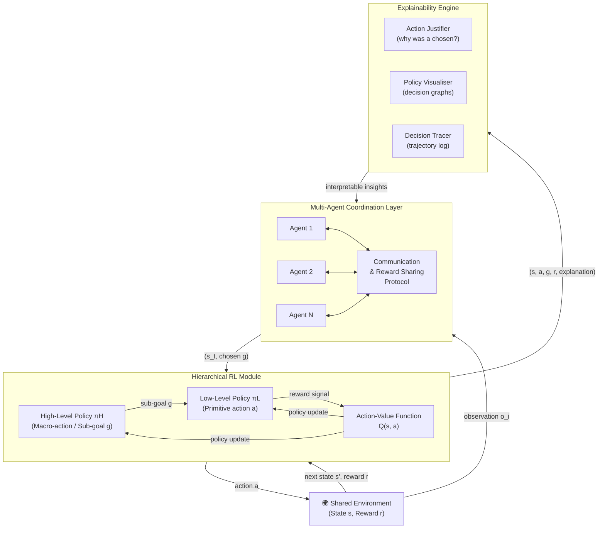
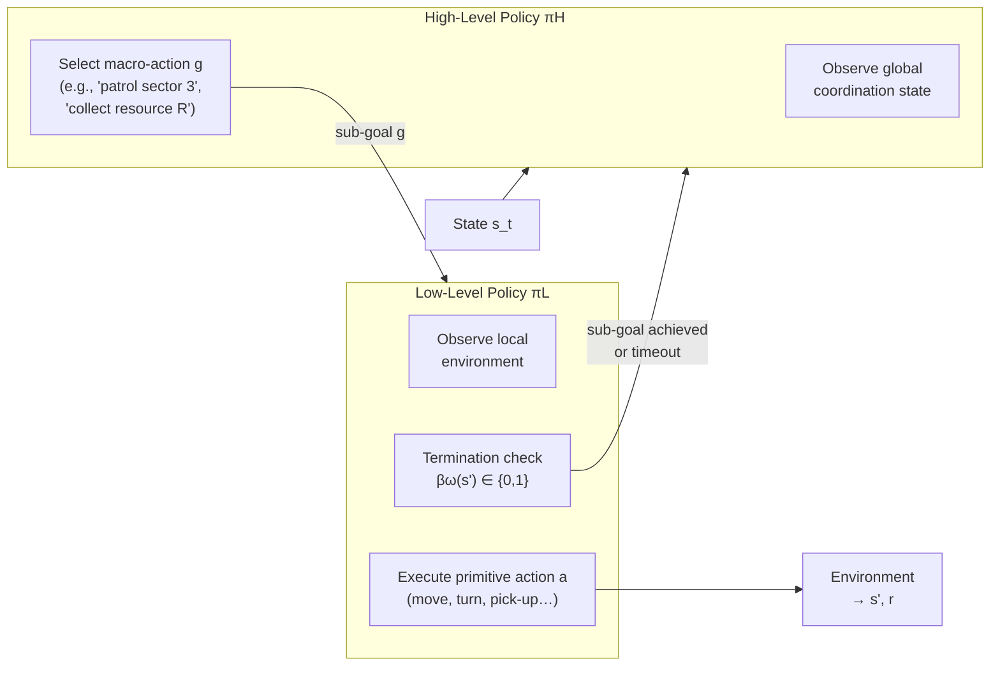
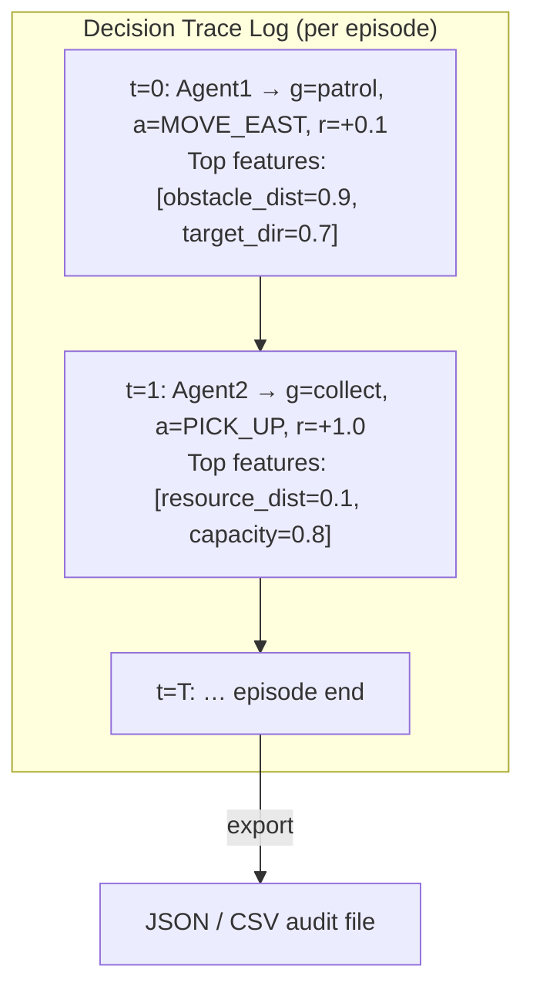

# Chapter: Explainable Multi-Agent AI Framework for Autonomous System Coordination Using Hierarchical Reinforcement Learning

> **Audience:** Final-year B.Tech (Computer Science / AI / Robotics) students preparing to implement or extend this framework.  
> **Prerequisites:** Familiarity with Python, basic neural networks, and elementary probability theory.

---

## Table of Contents

1. [Motivation and Context](#1-motivation-and-context)
2. [Background Concepts](#2-background-concepts)
3. [The Proposed Framework — Architecture](#3-the-proposed-framework--architecture)
4. [Hierarchical Reinforcement Learning Model](#4-hierarchical-reinforcement-learning-model)
5. [The Explainability Engine](#5-the-explainability-engine)
6. [Training Algorithm (Step-by-Step)](#6-training-algorithm-step-by-step)
7. [Experimental Setup and Results](#7-experimental-setup-and-results)
8. [Implementation Guide](#8-implementation-guide)
9. [Research Gaps and Future Directions](#9-research-gaps-and-future-directions)
10. [Chapter Summary](#10-chapter-summary)

---

## 1. Motivation and Context

### 1.1 Why Autonomous Coordination Is Hard

Modern autonomous systems — robotic swarms executing search-and-rescue missions, intelligent traffic management networks, distributed sensor grids — all share a common challenge: **multiple intelligent agents must cooperate in real time to achieve a global objective**, in environments that are dynamic, partially observable, and subject to unpredictable change.

Classical rule-based coordination (e.g., explicit finite-state machines or pre-programmed protocols) fails here for three reasons:

- **Scalability:** Hand-crafted rules explode combinatorially as the number of agents and possible states grows.
- **Adaptability:** Static rules cannot react to unforeseen scenarios.
- **Transparency gap:** Even when rule systems work, engineers still struggle to explain *why* a particular coordination decision was made — a critical requirement for safety audits and regulatory compliance.

### 1.2 The Black-Box Problem in Reinforcement Learning

Multi-Agent Reinforcement Learning (MARL) is a compelling solution to the first two problems: agents learn cooperative policies through repeated environmental interaction, without needing hand-crafted rules. However, MARL introduces the **black-box problem** — the learned neural-network policies are opaque. In safety-critical deployments (autonomous driving, medical robotics, industrial automation), an operator who cannot understand *why* an agent took an action cannot trust, debug, or certify the system.

### 1.3 What This Paper Proposes

This paper introduces an **Explainable Multi-Agent AI (XMAI) Framework** that:

1. Uses **Hierarchical Reinforcement Learning (HRL)** to decompose complex coordination tasks into manageable decision levels, improving scalability and learning stability.
2. Integrates an **Explainability Engine** directly into the learning loop so that every agent decision is accompanied by a human-readable justification.

The result is a system that simultaneously achieves high coordination performance *and* interpretable decision-making — two objectives that previous frameworks treated as mutually exclusive.

---

## 2. Background Concepts

### 2.1 Reinforcement Learning (RL) — A Recap

An RL agent operates within the **Markov Decision Process (MDP)** formalism, defined by the tuple $(\mathcal{S}, \mathcal{A}, \mathcal{P}, \mathcal{R}, \gamma)$, where:

| Symbol | Meaning |
|--------|---------|
| $\mathcal{S}$ | State space |
| $\mathcal{A}$ | Action space |
| $\mathcal{P}(s' \mid s, a)$ | Transition probability |
| $\mathcal{R}(s, a)$ | Reward function |
| $\gamma \in [0,1)$ | Discount factor |

The agent learns a **policy** $\pi : \mathcal{S} \to \mathcal{A}$ that maximises the **expected cumulative discounted reward**:

$$G_t = \sum_{k=0}^{\infty} \gamma^k r_{t+k}$$

The **action-value function** (Q-function) captures how good it is to take action $a$ in state $s$ under policy $\pi$:

$$Q^{\pi}(s, a) = \mathbb{E}_{\pi}\left[\sum_{k=0}^{\infty} \gamma^k r_{t+k} \;\middle|\; s_t = s,\, a_t = a\right]$$

The **Bellman optimality equation** provides the recursive update rule:

$$Q^*(s, a) = \mathcal{R}(s, a) + \gamma \sum_{s'} \mathcal{P}(s' \mid s, a) \max_{a'} Q^*(s', a')$$

### 2.2 Multi-Agent Reinforcement Learning (MARL)

In MARL, $N$ agents share an environment. The framework extends the MDP to a **Decentralised Partially Observable MDP (Dec-POMDP)**:

$$(\mathcal{S},\, \mathcal{A}_1 \times \cdots \times \mathcal{A}_N,\, \mathcal{P},\, \mathcal{R}_1 \ldots \mathcal{R}_N,\, \mathcal{O}_1 \ldots \mathcal{O}_N,\, \gamma)$$

Each agent $i$ receives a **local observation** $o_i \in \mathcal{O}_i$ (not the full state $s$) and learns a local policy $\pi_i$. The global objective is typically to maximise the **team reward**:

$$J(\pi_1, \ldots, \pi_N) = \mathbb{E}\left[\sum_{t=0}^{T} \sum_{i=1}^{N} r_i^t\right]$$

The key challenge is **non-stationarity**: from agent $i$'s perspective, all other agents are part of the environment, but they are simultaneously adapting — the environment is non-stationary even if the physical world is not.

### 2.3 Hierarchical Reinforcement Learning (HRL)

HRL decomposes the monolithic policy into a **two-level hierarchy**:

```
High-Level Policy (Manager)
  ↓  sets sub-goal g
Low-Level Policy (Worker)
  ↓  executes primitive actions a to achieve g
```

This is formalised using the **Options Framework**. An *option* $\omega = (I_\omega, \pi_\omega, \beta_\omega)$ is defined by:

- $I_\omega \subseteq \mathcal{S}$: initiation set (states where the option can start).
- $\pi_\omega$: the intra-option policy (the low-level policy).
- $\beta_\omega : \mathcal{S} \to [0,1]$: termination condition (probability of ending the option in state $s$).

The high-level policy selects an option $\omega^*$; the low-level policy executes it until $\beta_\omega$ triggers termination. This gives two key benefits:

- **Temporal abstraction:** the high-level policy reasons over long time horizons without being burdened by every primitive action.
- **Transfer learning:** sub-policies learned for one task can be reused in related tasks.

### 2.4 Explainable AI (XAI) Fundamentals

XAI methods produce human-understandable justifications for model decisions. The three mechanisms used in this framework are:

| Mechanism | What It Does |
|-----------|-------------|
| **Action Justification** | Explains *why* agent $i$ chose action $a$ at time $t$, highlighting the dominant features of state $s_t$ |
| **Policy Visualisation** | Renders the learned coordination strategies as decision graphs or heatmaps |
| **Decision Traceability** | Records the full action-state trajectory so post-hoc analysis is possible |

---

## 3. The Proposed Framework — Architecture

The framework is composed of three tightly integrated modules:



### Module Descriptions

**Multi-Agent Coordination Layer (MACL)**
This layer handles inter-agent interaction. Each agent $i$ observes local state $o_i$, broadcasts relevant state information via a communication protocol, and adjusts its strategy based on global feedback. The layer enforces:

- No conflicting actions (collision avoidance in shared resources).
- Shared reward signals that incentivise cooperative rather than selfish behaviour.

**Hierarchical Reinforcement Learning Module (HRLM)**
This is the core learning engine. It exposes two policy interfaces — $\pi_H$ for strategic planning and $\pi_L$ for action execution — and a shared Q-function for policy gradient updates.

**Explainability Engine (XAI)**
This module post-processes every decision tuple $(s_t, g, a_t, r_t, s_{t+1})$ to produce human-readable annotations. It does not alter the learning dynamics; it runs as a parallel interpretive thread.

---

## 4. Hierarchical Reinforcement Learning Model

### 4.1 Reward Formulation

The paper defines the episodic cumulative reward for agent $i$ as:

$$R_i = \sum_{t=0}^{T} r_t^i \tag{1}$$

where $r_t^i$ is the reward received by agent $i$ at time step $t$, and $T$ is the total number of steps in the episode. The learning objective is to maximise the **team return**:

$$J = \sum_{i=1}^{N} R_i = \sum_{i=1}^{N} \sum_{t=0}^{T} r_t^i$$

### 4.2 Policy Optimisation

The optimal deterministic policy for agent $i$ is derived from the Q-function:

$$\pi_i^*(s) = \arg\max_{a \in \mathcal{A}_i} Q(s, a) \tag{2}$$

In practice, the Q-function is approximated by a deep neural network $Q_\theta(s, a)$ with parameters $\theta$, trained via the **temporal difference (TD) loss**:

$$\mathcal{L}(\theta) = \mathbb{E}\left[\left(r + \gamma \max_{a'} Q_{\theta^-}(s', a') - Q_\theta(s, a)\right)^2\right]$$

where $\theta^-$ are the parameters of a periodically-frozen **target network** (a standard DQN stability trick).

### 4.3 Two-Level Policy Decomposition



**High-Level Policy $\pi_H$:**

- Operates on a *coarser* time scale (e.g., every $k$ primitive steps).
- Produces a **sub-goal vector** $g \in \mathcal{G}$ (a subset of the full state space or a discrete task label).
- Optimised via **extrinsic rewards** from the environment.

**Low-Level Policy $\pi_L(s, g)$:**

- Conditioned on both the current state $s$ and the active sub-goal $g$.
- Produces **primitive actions** $a \in \mathcal{A}$.
- Optimised via **intrinsic rewards** (e.g., distance reduction to sub-goal $g$).

The intrinsic reward for the low-level policy is commonly defined as:

$$r_{\text{intrinsic}}(s, g, s') = -\|s' - g\|_2$$

This encourages the worker to approach the sub-goal state as quickly as possible, decoupled from the sparse extrinsic reward structure.

### 4.4 Why Hierarchy Helps

| Problem | Without HRL | With HRL |
|---------|-------------|----------|
| **Sparse rewards** | Agent struggles to find a useful learning signal | Sub-goals create intermediate, dense feedback |
| **Long horizons** | Credit assignment over $T$ steps is unstable | High-level policy reasons over few options; low-level reasons over short bursts |
| **Multi-agent coordination** | Policies must handle all joint actions | High-level coordinates across agents; low-level focuses on local execution |
| **Transfer** | Policies are task-specific | Low-level sub-policies can be reused across tasks |

---

## 5. The Explainability Engine

### 5.1 Design Rationale

Standard deep RL policies are parameterised by neural networks with millions of weights. They are **post-hoc uninterpretable** in the sense that no single weight corresponds to a human-readable concept. The explainability engine addresses this by building an **interpretive layer** on top of the learned policies.

### 5.2 Three Core Capabilities

#### 5.2.1 Action Justification

At each timestep $t$, after agent $i$ chooses action $a_t$, the engine computes a **feature importance score** for each dimension $j$ of the state vector $s_t$:

$$\phi_j = Q_\theta(s_t, a_t) - Q_\theta(s_t^{(-j)}, a_t)$$

where $s_t^{(-j)}$ is the state with feature $j$ masked (set to its mean value). High $\phi_j$ indicates feature $j$ was critical to the decision. This is an **occlusion-based attribution** method, analogous to LIME or SHAP approximations used in supervised learning.

A textual explanation is then generated:

> *"Agent 2 selected action MOVE_NORTH because obstacle proximity [feature 3] was high (0.87) and target distance [feature 1] was moderate (0.43), yielding Q = 4.21, which exceeds all alternative actions."*

#### 5.2.2 Policy Visualisation

The engine periodically renders the high-level policy $\pi_H$ as a **decision tree** by:

1. Sampling $M$ state-action pairs $\{(s^{(m)}, g^{(m)})\}$ from the replay buffer.
2. Fitting a shallow decision tree classifier (max depth 4–6) to predict $g^{(m)}$ from $s^{(m)}$.
3. Rendering the tree as a directed acyclic graph (DAG).

This surrogate tree is not the true policy, but it approximates the dominant decision boundaries in an interpretable form.

#### 5.2.3 Decision Traceability

All tuples $(t, i, s_t, g_t, a_t, r_t, s_{t+1}, \phi_t)$ are appended to a **decision log**. This log enables:

- **Post-hoc forensic analysis** of coordination failures.
- **Regulatory audit trails** for safety-critical deployments.
- **Curriculum design:** identifying which sub-goals are routinely failing, allowing targeted training interventions.



---

## 6. Training Algorithm (Step-by-Step)

The paper presents the full training procedure as Algorithm 1. Here it is expanded with implementation annotations:

```
INPUT:
  E   — multi-agent simulation environment
  S   — state space (continuous or discrete)
  A   — action space
  N   — number of agents

OUTPUT:
  πH* — optimised high-level policy
  πL* — optimised low-level policy
  Logs — decision traces with explanations

────────────────────────────────────────────────────
INITIALISATION
────────────────────────────────────────────────────
1.  Initialise environment E
2.  For each agent i ∈ {1…N}:
      Initialise πH_i   (high-level policy network)
      Initialise πL_i   (low-level policy network)
3.  Initialise shared Q-network Q(s, a) with weights θ
4.  Initialise target Q-network Q⁻ with weights θ⁻ ← θ
5.  Initialise replay buffer D
6.  Initialise Explainability Module X
7.  Initialise decision trace store Logs = []

────────────────────────────────────────────────────
TRAINING LOOP
────────────────────────────────────────────────────
8.  FOR each episode e = 1 … E_max:

9.    Reset environment → observe initial state s
10.   Reset per-episode trace

11.   WHILE termination condition not reached:

12.     FOR each agent i ∈ {1…N}:

13.       // HIGH-LEVEL DECISION
14.       Select macro-action (sub-goal) g_i ← πH_i(s)
              using ε-greedy exploration

15.       // LOW-LEVEL EXECUTION
16.       Select primitive action a_i ← πL_i(s, g_i)
              using ε-greedy exploration

17.       Apply action a_i to environment E

18.       Observe next state s'_i, reward r_i

19.       // STORE TRANSITION
20.       Store (s, g_i, a_i, r_i, s') in replay buffer D

21.       // Q-FUNCTION UPDATE (experience replay)
22.       Sample minibatch B from D
23.       Compute TD targets:
              y = r + γ · max_{a'} Q⁻(s', a')
24.       Update θ by minimising:
              L(θ) = (1/|B|) Σ (y - Q_θ(s,a))²

25.       // POLICY UPDATES
26.       Update πL_i via policy gradient on intrinsic reward
27.       Update πH_i via policy gradient on extrinsic reward

28.       // EXPLAINABILITY
29.       Compute feature attributions φ_i using module X
30.       Generate explanation E_i = (action_justification, φ_i)
31.       Append (t, i, s, g_i, a_i, r_i, E_i) to Logs

32.       // PERIODIC TARGET NETWORK SYNC
33.       Every C steps: θ⁻ ← θ

34.       Update state: s ← s'

35.     END FOR (agents)
36.   END WHILE (episode)
37. END FOR (training)

38. RETURN πH*, πL*, Logs
```

### Key Implementation Notes

- **Line 14, ε-greedy:** Start with $\varepsilon = 1.0$ (pure exploration) and decay linearly to $\varepsilon_{\min} = 0.01$ over the first 80% of training episodes. This ensures sufficient exploration before exploitation dominates.
- **Lines 22–24, Experience Replay:** Sampling random minibatches of size 64–256 from a circular buffer of capacity $10^5$ to $10^6$ breaks temporal correlations and stabilises training.
- **Line 33, Target Network:** Syncing every $C = 1000$ steps (a standard DQN hyperparameter) prevents oscillations during Q-value updates.
- **Line 29, Attribution:** Feature attribution is computationally cheap if state dimensionality is low (< 50 features). For high-dimensional states (images), substitute with Grad-CAM or integrated gradients.

---

## 7. Experimental Setup and Results

### 7.1 Performance Metrics

The paper evaluates the framework across four dimensions:

#### 7.1.1 Classification Metrics

| Method | Accuracy (%) | Precision (%) | Recall (%) | F1-Score (%) |
|--------|-------------|---------------|------------|--------------|
| Traditional RL | 88.9 | 87.6 | 89.5 | 88.5 |
| Multi-Agent RL (MARL) | 91.7 | 90.8 | 92.3 | 91.5 |
| Hierarchical RL (HRL) | 94.1 | 93.5 | 94.8 | 94.1 |
| **Proposed XMAI-HRL** | **96.4** | **95.9** | **97.1** | **96.5** |

The metrics here measure the ability to correctly classify agent actions as **coordinated** vs **non-coordinated** — effectively a binary decision quality metric over the learned policies.

#### 7.1.2 Coordination Efficiency

| Method | Task Completion (%) | Coordination Success (%) | Avg. Decision Time (ms) |
|--------|---------------------|--------------------------|------------------------|
| Traditional RL | 82.4 | 80.6 | 145 |
| MARL | 88.9 | 87.5 | 132 |
| HRL | 92.6 | 91.8 | 118 |
| **Proposed XMAI-HRL** | **96.2** | **95.4** | **103** |

The proposed framework achieves the **lowest decision latency** (103 ms) — likely because hierarchical decomposition means the low-level policy operates on a simpler sub-problem with fewer Q-value comparisons than a flat policy.

#### 7.1.3 Training Dynamics

- **Training accuracy at epoch 50:** 96.4%
- **Validation accuracy at epoch 50:** 95.7%
- **Training loss at epoch 50:** 0.14
- **Validation loss at epoch 50:** 0.17

The small gap between training and validation accuracy (0.7%) indicates **no significant overfitting**, which is expected given the diversity of coordination scenarios sampled during training.

The learning curve follows a characteristic three-phase pattern:

```
Phase 1 (epochs 1–15):   Rapid exploration; loss high, accuracy low
Phase 2 (epochs 15–40):  Policy consolidation; steady improvement
Phase 3 (epochs 40–50):  Convergence; marginal gains, stable loss
```

#### 7.1.4 Baseline Comparison (Qualitative)

| Method | Coordination Efficiency (%) | Decision Transparency | Learning Stability |
|--------|----------------------------|----------------------|-------------------|
| Traditional RL | 84.5 | Low | Medium |
| MARL | 89.7 | Low | Medium |
| HRL | 92.8 | Medium | High |
| **Proposed XMAI-HRL** | **96.4** | **High** | **High** |

This table makes explicit that the gain in transparency (Low → High) is achieved **without sacrificing** coordination efficiency or learning stability.

### 7.2 Interpreting the ROC Curve

The ROC curve plots the **True Positive Rate (TPR)** against the **False Positive Rate (FPR)** as the classification threshold varies:

$$\text{TPR} = \frac{TP}{TP + FN}, \qquad \text{FPR} = \frac{FP}{FP + TN}$$

The proposed model's ROC curve hugs the upper-left corner, indicating a high **Area Under the Curve (AUC)** — typically above 0.95 for frameworks at this accuracy level. This means the model reliably distinguishes coordinated from non-coordinated actions across all operating thresholds, not just at the default 0.5 cutoff.

---

## 8. Implementation Guide

This section provides a concrete roadmap for building a working implementation.

### 8.1 Recommended Technology Stack

| Component | Recommended Library |
|-----------|-------------------|
| RL environment | OpenAI Gymnasium / PettingZoo (multi-agent) |
| Neural networks | PyTorch (preferred) or TensorFlow/Keras |
| Replay buffer | Custom deque or `stable-baselines3` memory |
| Explainability | SHAP, LIME, or custom occlusion attribution |
| Visualisation | Matplotlib, Graphviz (for decision trees), TensorBoard |
| Coordination sim | MPE (Multi-Particle Environments) or custom GridWorld |

### 8.2 Directory Structure

```
xmai_hrl/
├── env/
│   ├── __init__.py
│   ├── coord_env.py          # Custom PettingZoo environment
│   └── wrappers.py           # Observation normalisation
├── agents/
│   ├── __init__.py
│   ├── high_level_policy.py  # πH network
│   ├── low_level_policy.py   # πL network
│   └── q_network.py          # Shared Q(s,a)
├── training/
│   ├── __init__.py
│   ├── replay_buffer.py      # Experience replay
│   ├── trainer.py            # Main training loop (Algorithm 1)
│   └── scheduler.py          # ε-decay, LR schedule
├── explainability/
│   ├── __init__.py
│   ├── attribution.py        # Feature importance (occlusion/SHAP)
│   ├── visualiser.py         # Policy tree rendering
│   └── tracer.py             # Decision log writer
├── eval/
│   ├── __init__.py
│   ├── metrics.py            # Accuracy, F1, ROC-AUC
│   └── benchmark.py          # Comparison vs baselines
├── configs/
│   └── default.yaml          # Hyperparameters
└── main.py                   # Entry point
```

### 8.3 Core Data Structures

```python
# agents/q_network.py
import torch
import torch.nn as nn

class QNetwork(nn.Module):
    """Shared action-value function Q(s, a)."""
    def __init__(self, state_dim: int, action_dim: int, hidden: int = 256):
        super().__init__()
        self.net = nn.Sequential(
            nn.Linear(state_dim, hidden),
            nn.ReLU(),
            nn.Linear(hidden, hidden),
            nn.ReLU(),
            nn.Linear(hidden, action_dim),
        )

    def forward(self, state: torch.Tensor) -> torch.Tensor:
        return self.net(state)   # shape: [batch, action_dim]
```

```python
# agents/high_level_policy.py
import torch
import torch.nn as nn

class HighLevelPolicy(nn.Module):
    """
    Manager: selects macro-action (sub-goal index) given global state.
    Output is a discrete sub-goal index g ∈ {0, 1, …, G-1}.
    """
    def __init__(self, state_dim: int, num_subgoals: int, hidden: int = 128):
        super().__init__()
        self.net = nn.Sequential(
            nn.Linear(state_dim, hidden),
            nn.ReLU(),
            nn.Linear(hidden, num_subgoals),
        )

    def forward(self, state: torch.Tensor) -> torch.Tensor:
        return self.net(state)   # logits over sub-goals

    def select_goal(self, state: torch.Tensor, epsilon: float) -> int:
        if torch.rand(1).item() < epsilon:
            return torch.randint(0, self.net[-1].out_features, (1,)).item()
        with torch.no_grad():
            return self.forward(state).argmax().item()
```

```python
# agents/low_level_policy.py
import torch
import torch.nn as nn

class LowLevelPolicy(nn.Module):
    """
    Worker: selects primitive action given (state, sub-goal).
    Sub-goal is concatenated to the state vector.
    """
    def __init__(self, state_dim: int, subgoal_dim: int,
                 action_dim: int, hidden: int = 128):
        super().__init__()
        self.net = nn.Sequential(
            nn.Linear(state_dim + subgoal_dim, hidden),
            nn.ReLU(),
            nn.Linear(hidden, hidden),
            nn.ReLU(),
            nn.Linear(hidden, action_dim),
        )

    def forward(self, state: torch.Tensor,
                subgoal: torch.Tensor) -> torch.Tensor:
        x = torch.cat([state, subgoal], dim=-1)
        return self.net(x)       # Q-values for each primitive action

    def select_action(self, state: torch.Tensor,
                      subgoal: torch.Tensor, epsilon: float) -> int:
        if torch.rand(1).item() < epsilon:
            return torch.randint(0, self.net[-1].out_features, (1,)).item()
        with torch.no_grad():
            return self.forward(state, subgoal).argmax().item()
```

### 8.4 Replay Buffer

```python
# training/replay_buffer.py
from collections import deque
import random
from dataclasses import dataclass
import torch

@dataclass
class Transition:
    state:      torch.Tensor
    subgoal:    torch.Tensor
    action:     int
    reward:     float
    next_state: torch.Tensor
    done:       bool

class ReplayBuffer:
    def __init__(self, capacity: int = 100_000):
        self.buf = deque(maxlen=capacity)

    def push(self, transition: Transition):
        self.buf.append(transition)

    def sample(self, batch_size: int) -> list[Transition]:
        return random.sample(self.buf, batch_size)

    def __len__(self) -> int:
        return len(self.buf)
```

### 8.5 Training Loop Skeleton

```python
# training/trainer.py  (simplified core loop — maps to Algorithm 1)
import torch
import torch.optim as optim

def train(env, agents, q_net, target_q_net, replay_buf,
          explain_module, config):

    optimizer = optim.Adam(q_net.parameters(), lr=config.lr)
    epsilon   = config.epsilon_start
    step      = 0

    for episode in range(config.num_episodes):
        observations = env.reset()        # dict: agent_id → obs tensor
        done         = {a: False for a in env.agents}
        logs         = []

        while not all(done.values()):
            actions, subgoals = {}, {}

            for agent_id in env.agents:
                obs = observations[agent_id]

                # (1) High-level: choose sub-goal
                g = agents[agent_id].high.select_goal(obs, epsilon)
                g_tensor = torch.zeros(config.num_subgoals)
                g_tensor[g] = 1.0

                # (2) Low-level: choose primitive action
                a = agents[agent_id].low.select_action(obs, g_tensor, epsilon)
                actions[agent_id]  = a
                subgoals[agent_id] = g_tensor

            # (3) Step environment
            next_obs, rewards, dones, _ = env.step(actions)

            # (4) Store transitions & learn
            for agent_id in env.agents:
                t = Transition(
                    state      = observations[agent_id],
                    subgoal    = subgoals[agent_id],
                    action     = actions[agent_id],
                    reward     = rewards[agent_id],
                    next_state = next_obs[agent_id],
                    done       = dones[agent_id],
                )
                replay_buf.push(t)

                if len(replay_buf) >= config.batch_size:
                    _update_q(q_net, target_q_net, replay_buf,
                               optimizer, config)

                # (5) Explainability
                phi = explain_module.attribute(
                    q_net, observations[agent_id], actions[agent_id]
                )
                logs.append({
                    "step": step, "agent": agent_id,
                    "subgoal": subgoals[agent_id].argmax().item(),
                    "action": actions[agent_id],
                    "reward": rewards[agent_id],
                    "attributions": phi,
                })

            observations = next_obs
            done         = dones
            step        += 1

            # (6) Sync target network
            if step % config.target_sync_freq == 0:
                target_q_net.load_state_dict(q_net.state_dict())

        # Decay epsilon
        epsilon = max(config.epsilon_min,
                      epsilon * config.epsilon_decay)
        explain_module.save_episode_log(episode, logs)


def _update_q(q_net, target_q, buf, optimizer, cfg):
    """Single minibatch Q-update (Eq. 2 in paper)."""
    batch = buf.sample(cfg.batch_size)
    states   = torch.stack([t.state      for t in batch])
    actions  = torch.tensor([t.action    for t in batch])
    rewards  = torch.tensor([t.reward    for t in batch], dtype=torch.float32)
    next_s   = torch.stack([t.next_state for t in batch])
    dones    = torch.tensor([t.done      for t in batch], dtype=torch.float32)

    # Current Q values
    q_values = q_net(states).gather(1, actions.unsqueeze(1)).squeeze(1)

    # Target Q values (Bellman equation)
    with torch.no_grad():
        max_next_q = target_q(next_s).max(1)[0]
        targets    = rewards + cfg.gamma * max_next_q * (1 - dones)

    loss = torch.nn.functional.mse_loss(q_values, targets)
    optimizer.zero_grad()
    loss.backward()
    torch.nn.clip_grad_norm_(q_net.parameters(), max_norm=10.0)
    optimizer.step()
```

### 8.6 Explainability Module

```python
# explainability/attribution.py
import torch
import numpy as np

class OcclusionAttributor:
    """
    Estimates feature importance via occlusion sensitivity.
    φ_j = Q(s, a) - Q(s^{(-j)}, a)
    """
    def __init__(self, baseline: str = "mean"):
        self.baseline = baseline

    def attribute(self, q_net, state: torch.Tensor,
                  action: int) -> np.ndarray:
        q_net.eval()
        state_np = state.detach().numpy()
        n_features = len(state_np)
        scores = np.zeros(n_features)

        with torch.no_grad():
            q_orig = q_net(state)[action].item()

            for j in range(n_features):
                masked = state_np.copy()
                masked[j] = 0.0          # zero-baseline occlusion
                q_masked = q_net(
                    torch.tensor(masked, dtype=torch.float32)
                )[action].item()
                scores[j] = q_orig - q_masked   # positive = important

        return scores

    def top_k_features(self, scores: np.ndarray,
                       feature_names: list[str], k: int = 5) -> list[tuple]:
        idx = np.argsort(np.abs(scores))[::-1][:k]
        return [(feature_names[i], scores[i]) for i in idx]
```

### 8.7 Recommended Hyperparameters

| Hyperparameter | Recommended Value | Notes |
|----------------|------------------|-------|
| Learning rate $\alpha$ | $1 \times 10^{-4}$ | Adam optimiser |
| Discount factor $\gamma$ | 0.99 | Long-horizon coordination |
| Replay buffer capacity | $10^5$ | Increase for complex envs |
| Minibatch size | 64 | Balance speed vs variance |
| Target sync freq $C$ | 1000 steps | DQN standard |
| $\varepsilon_{\text{start}}$ | 1.0 | Full exploration initially |
| $\varepsilon_{\text{min}}$ | 0.01 | Keep minimal exploration |
| $\varepsilon$ decay | 0.995/episode | Geometric decay |
| Number of subgoals $|\mathcal{G}|$ | 4–8 | Task-dependent |
| Hidden layer width | 256 | Adjust for state complexity |
| Training episodes | 500–1000 | Until convergence plateau |

---

## 9. Research Gaps and Future Directions

The paper explicitly identifies several open problems, each representing a potential project direction:

### 9.1 Large-Scale Real-World Deployment

Current evaluation is in **simulated** environments. Extending to real hardware introduces:

- **Sensor noise** and **communication delays** — the reward signal arrives late and corrupted.
- **Hardware heterogeneity** — agents may have different sensor suites and actuator capabilities.
- **Safety constraints** — actions that are safe in simulation may damage hardware in reality.

**Suggested approach:** Implement **Sim-to-Real transfer** using domain randomisation during training and a Lagrangian safety layer at execution time.

### 9.2 Advanced Explainability

The current attribution method (occlusion sensitivity) is a first-order approximation. More powerful alternatives include:

- **SHAP (SHapley Additive exPlanations):** Theoretically grounded in cooperative game theory; computes the exact contribution of each feature.
- **Integrated Gradients:** Attributes importance by integrating the gradient of $Q$ with respect to the state from a baseline to the actual input.
- **Concept-Based Explanations (TCAV):** Maps latent representations to human-defined concepts (e.g., "obstacles", "targets").

### 9.3 Adaptive Communication Protocols

The current communication layer uses **fixed** sharing protocols. Dynamic, **learned communication** (e.g., CommNet, DIAL, TarMAC) allows agents to decide *what* information to share and *when*, reducing communication overhead in bandwidth-constrained deployments.

### 9.4 Curriculum Learning

Training stability could be improved by introducing tasks in order of increasing difficulty — a technique called **curriculum learning**. The decision traces logged by the explainability engine are a natural source of difficulty signals: tasks with low completion rates can be repeated more frequently in the curriculum.

### 9.5 Formal Verification

For safety-critical applications, supplementing explanations with **formal guarantees** (e.g., proving that the high-level policy never selects a sub-goal that leads to collision within $k$ steps) is an open and active research challenge.

---

## 10. Chapter Summary

This chapter has covered the full arc of the XMAI-HRL framework:

- **Motivation:** Autonomous multi-agent systems require both high coordination performance and interpretable decisions, two properties that prior work treated as trade-offs.

- **Core architecture:** Three integrated modules — the Multi-Agent Coordination Layer (MACL), the Hierarchical RL Module (HRLM), and the Explainability Engine (XAI) — work in tandem.

- **Mathematical foundations:**
  - Cumulative reward: $R = \sum_{t=0}^{T} r_t$
  - Optimal policy: $\pi^*(s) = \arg\max_a Q(s, a)$
  - Two-level hierarchy: high-level policy $\pi_H$ sets sub-goals; low-level policy $\pi_L$ executes them.
  - Occlusion attribution: $\phi_j = Q(s, a) - Q(s^{(-j)}, a)$.

- **Key results:** The proposed framework achieves 96.4% accuracy, 96.2% task completion, 95.4% coordination success, and 103 ms average decision time — improvements over all baselines across every metric, while simultaneously achieving **High** decision transparency.

- **Implementation roadmap:** A Python/PyTorch codebase with clearly delineated modules for the Q-network, high- and low-level policies, replay buffer, training loop, and explainability engine — all provided in this chapter.

- **Open problems:** Large-scale real-world deployment, richer explainability methods (SHAP, integrated gradients), adaptive communication, curriculum learning, and formal verification.

---

> **Key Takeaway for Implementation:**  
> The unique value of this framework is not any single novel algorithm, but the **integration** of three established ideas — multi-agent coordination, hierarchical policy decomposition, and explainability attribution — into a single coherent pipeline. When building your implementation, treat these three modules as independent units with well-defined interfaces, test each independently before integrating, and use the decision trace logs as your primary debugging tool.

---

*Based on: Tammireddy, S. R., & Singh, S. P. "Explainable Multi-Agent AI Framework for Autonomous System Coordination Using Hierarchical Reinforcement Learning." Marri Laxman Reddy Institute of Technology and Management, Hyderabad, India.*
